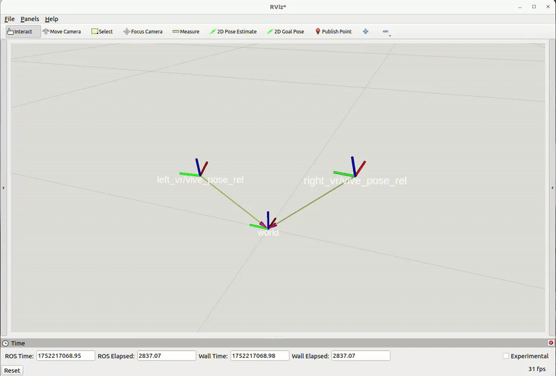

# vive_ros2

## Overview

This `vive_ros2` package provides a ROS2 interface to the HTC VIVE controllers. Due to compatibility issues between the OpenVR library and ROS2, this package utilizes socket programming to enable data transfer between two standalone programs running under ROS2 on Ubuntu.

https://github.com/user-attachments/assets/fa6a83e9-f711-4a8f-aed1-6e1cf5ae0147

## Installation Instructions

### 1. Install Steam and SteamVR
1. Install the latest version of Steam from [Steam Store](https://store.steampowered.com/).
2. Install SteamVR in the Steam application.

### 2. Download and Build OpenVR SDK
```bash
cd ~
mkdir libraries && cd libraries
git clone https://github.com/ValveSoftware/openvr.git -b v2.5.1
cd openvr
mkdir build && cd build
cmake -DCMAKE_BUILD_TYPE=Release ../
make
```

### 3. VR Setup
1. Follow the official [VIVE Pro Setup Guide](https://www.vive.com/hk/setup/vive-pro-hmd/) to setup the lighthouse, headset, controller, etc.
2. Plug in the VIVE and set the permission as below:
    ```bash
    sudo chmod +rw /dev/hidraw*
    ```
3. You are ready to use the VIVE.
<details>
<summary>(OPTIONAL) Build the sample code to test the VIVE setup.</summary>

```bash
cd ~/libraries/openvr/samples
mkdir build && cd build
cmake .. -G "Unix Makefiles" -DCMAKE_PREFIX_PATH=/opt/Qt/5.6/gcc_64/lib/cmake -DCMAKE_BUILD_TYPE=Release
```
Run the demo code as follows:
```bash
# copy the texture files to the bin folder
cd ~
cp libraries/openvr/samples/bin/cube_texture.png libraries/openvr/samples/bin/hellovr_* build
```
```bash
# Run demo code
~/.steam/steam/ubuntu12_32/steam-runtime/run.sh ~/vive_ws/libraries/openvr/samples/bin/linux64/hellovr_opengl
```   
</details>

## Usage
1. Clone the repository.
    ```bash
    # here I use ~/vive_ws as the ROS2 workspace, you can change it to your own workspace
    mkdir -p ~/vive_ws/src && cd ~/vive_ws/src
    git clone https://github.com/iltlo/vive_ros2.git
    ```
2. Build the package.
    ```bash
    cd ~/vive_ws
    colcon build --packages-select vive_ros2
    source install/setup.bash
    ```
3.  Set the environment variables.
    ```bash
    # for bash shell
    echo 'alias setup_vive="source ~/vive_ws/src/vive_ros2/scripts/set_vr_env.sh && source ~/vive_ws/install/setup.bash"' >> ~/.bashrc
    source ~/.bashrc
    ```
    ```bash
    # for zsh shell
    echo 'alias setup_vive="source ~/vive_ws/src/vive_ros2/scripts/set_vr_env.sh && source ~/vive_ws/install/setup.zsh"' >> ~/.zshrc
    source ~/.zshrc
    ```
4. Start SteamVR.
    ```bash
    setup_vive && $STEAMVR/bin/linux64/vrserver --keepalive
    ```
5. Run the package.
    ```bash
    # Terminal 1:
    ros2 run vive_ros2 vive_input
    # Terminal 2:
    ros2 run vive_ros2 vive_node 100 # 100 Hz for each controller
    ```

## Demo
Using VIVE Pro controller to control a [WidowX-250-S](https://docs.trossenrobotics.com/interbotix_xsarms_docs/specifications/wx250s.html) robot arm in ROS2 (using absolute pose).


Visualizing the absolute and relative poses of the controller on RViz.


Visualizing the use of dual controllers.


## Development Status
- [x]  Obtain absolute pose data of controller
- [x]  Implement the server client model
- [x]  Haptic feedback to enhance user experience
- [x]  Solve relative transformations
- [x]  Add bounding conditions 
- [x]  Separate handling for left and right VR controllers
- [ ]  Refactor code to improve readability
- [x]  Optimize performance
- [ ]  Server-client 2-way communication

## Development Environment
- Ubuntu 22.04
- ROS2 Humble
- OpenVR SDK v2.5.1
- HTC VIVE Pro
